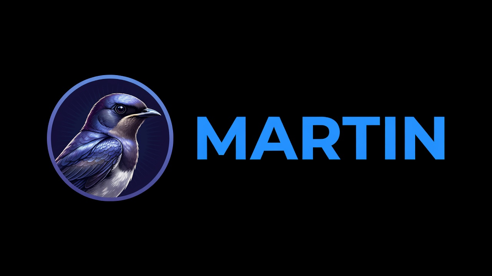

<p align="center">
  
</p>

# Martin

[](https://github.com/kyle-visner/martin/actions/workflows/ci.yml)

## TL;DR

Martin is an opinionated CRM CLI for humans and AI agents. It provides one
guarded path for organizations, people, a fixed sales pipeline, activities,
relationship tasks, Magpie customer links, daily work reports, and idempotent
JSON imports. The CLI checks access and CRM invariants before appending an
encrypted, immutable event to
[Jaybase](https://github.com/kyle-visner/jaybase).

Requires Go 1.26.5 or later. Earlier Go releases include known standard-library
vulnerabilities and must not be used to build release binaries:

```sh
git clone https://github.com/kyle-visner/martin.git
cd martin
go install ./cmd/martin
martin --store .martin --actor owner init --currency USD
```

The initialized local workspace uses the supplied ISO currency and accepts the
`owner` actor until Magpie initializes shared users on the same Jaybase root.
Read [Shared Jaybase history](#shared-jaybase-history) before production use.

## Who Martin is for

Martin is for small teams that want agents to help with CRM work without giving
them raw database access or permission to invent pipeline behavior. It fits
prospect intake, deal hygiene, relationship follow-up, controlled migrations,
and other jobs where writes must be attributable, auditable, safe to retry, and
rejected when they violate policy.

Martin is a CLI and domain engine, not a hosted CRM SaaS, marketing automation
platform, or support desk. Martin, Magpie, and Jaybase are single-tenant: one
organization, one trust boundary, and one operator (often a trusted AI chat
acting for an admin). Use the local backend for development or a trusted
single-user process. For production, run Martin against a separately deployed
Jaybase service owned by that same operator trust boundary.

## Status and scope

Martin is pre-1.0. The implemented CRM surface is usable and tested. This
release includes the capabilities listed below. The following features are
outside its current scope:

- marketing automation, bulk email sending, sequences, or campaign analytics;
- support tickets, SLAs, product catalogs, or arbitrary workflow builders;
- predictive lead scoring, enrichment marketplaces, or fuzzy duplicate merge
  suggestions;
- a human-oriented output mode, interactive UI, signed command envelopes, or an
  authentication layer that proves `--actor` identity;
- multi-pipeline customization or free-form stage graphs.

Those are product-scope boundaries, not hidden installation steps. See
[`docs/SECURITY.md`](docs/SECURITY.md) for additional production controls that
remain the deployer's responsibility.

## Project layout

- The repository root is the CRM CLI project.
- `cmd/martin` contains the CLI and `internal/martin` contains the CRM domain.
- Jaybase is maintained separately at
  [`github.com/kyle-visner/jaybase`](https://github.com/kyle-visner/jaybase).
  Martin pins it as a Go module dependency.
- Magpie is the sibling accounting CLI at
  [`github.com/kyle-visner/magpie`](https://github.com/kyle-visner/magpie).

## License

AGPL-3.0-or-later. See `LICENSE`.

## Current capabilities

- Canonical CLI in `cmd/martin` with local embedded and hosted Jaybase backends.
- Append-only, SHA-256-addressed event history through Jaybase.
- Bearer-authenticated hosted Jaybase access over HTTPS with paginated replay,
  optimistic concurrency, idempotent writes, and remote named refs.
- One fixed pipeline: `new -> qualified -> proposal -> won|lost`.
- Operating rule: every open deal has exactly one pending next action.
- Organizations and people with archive/merge, unique emails, and unique domains.
- Calls, emails, meetings, and notes as immutable activities.
- Relationship follow-up tasks that cannot be attached as generic deal tasks.
- Explicit one-to-one Magpie customer links and a combined customer view.
- Daily work (`today`) and pipeline reports.
- Idempotent normalized JSON imports keyed by `(source, source_key)`.
- Optional encrypted, token-bound hosted projection checkpoints.
- JSON command output by default for agent consumption.
- Automated tests for domain invariants, remote storage behavior, and CLI flows.

## The operating rule

Every open deal has exactly one pending next action.

- `deal create` requires the first next action.
- `deal advance` completes the old action and creates the next one while moving
  one stage (`new -> qualified -> proposal`).
- `deal touch` atomically records an interaction, completes the old action, and
  creates the next one.
- `deal win` and `deal lose` close the outstanding action.
- Proposal-stage deals must be won or lost; they cannot advance further.
- Generic tasks cannot be attached to deals. This keeps deal work on the one
  canonical workflow.

## Build and verify

Use Go 1.26.5 or later. From the repository root:

```sh
go mod verify
go test -race ./...
go vet ./...
go build -o ./martin ./cmd/martin
go install golang.org/x/vuln/cmd/govulncheck@v1.6.0
govulncheck ./...
```

If your environment blocks the default Go build cache, use a writable cache:

```sh
GOCACHE=/private/tmp/martin-gocache go mod verify
GOCACHE=/private/tmp/martin-gocache go test -race ./...
GOCACHE=/private/tmp/martin-gocache go vet ./...
GOCACHE=/private/tmp/martin-gocache go build -o ./martin ./cmd/martin
```

The generated `./martin` binary is ignored by Git.

Tagged releases are built from clean `main` commits by
[`release.yml`](.github/workflows/release.yml) using the reproducible
[`scripts/build-release.sh`](scripts/build-release.sh) process. Each GitHub
Release includes macOS and Linux archives for amd64 and arm64 plus a
`SHA256SUMS` file.

## Agent integration pattern

Agents should read [`llm.md`](llm.md) as their operating contract. The short
pattern below shows the required invocation shape.

Give your agent a fixed command template and tell it to parse stdout as JSON:

```sh
./martin \
  --store .martin \
  --actor AGENT_USER_ID \
  COMMAND...
```

For the hosted Jaybase service, provide the origin and bearer credential through
the environment. Do not put the token in a command-line flag, URL, payload, log,
or idempotency key:

```sh
export JAYBASE_URL=https://jaybase.example.com
export JAYBASE_TOKEN='writer-token-from-the-secret-manager'
export MARTIN_CACHE_DIR="${XDG_CACHE_HOME:-$HOME/.cache}/martin"

./martin \
  --actor AGENT_USER_ID \
  COMMAND...
```

`--jaybase-url` may override the origin, but the token is accepted only through
`JAYBASE_TOKEN`. Hosted requests fetch decrypted payloads only when replaying
state; audit output remains metadata-only. Writes use Jaybase's `expected_root`
and `Idempotency-Key` contract and return a conflict instead of overwriting a
newer root.

`MARTIN_CACHE_DIR` is optional. When set, Martin stores an encrypted,
token-bound projection checkpoint there and incrementally replays only newer
facts. The checkpoint is a disposable performance aid, not a source of truth or
a backup. Keep the directory private and do not share it across untrusted users.

For development without building first, use:

```sh
go run ./cmd/martin \
  --store .martin \
  --actor AGENT_USER_ID \
  COMMAND...
```

Operational rules for agents:

- Treat stdout as the only success channel.
- Treat stderr as JSON error output.
- Never edit `.martin/` files or Jaybase objects/refs/keys directly.
- Never invent raw storage mutations.
- Select records by returned opaque IDs such as `org:...`, `person:...`, and
  `deal:...`; never construct or guess them.
- Keep every open deal on exactly one next action.
- Use `deal touch` for interaction-plus-next-step updates.
- Use Magpie for accounting facts; use Martin only for CRM facts and explicit
  customer links.
- Create a `snapshot create --name NAME` before large agent workflows.

Errors look like:

```json
{"code":"validation_error","message":"next action is required"}
```

## Shared Jaybase history

Martin is designed to run against the same Jaybase instance as Magpie.

```sh
export JAYBASE_URL=https://jaybase.example.com
export JAYBASE_TOKEN='writer-token-from-the-secret-manager'
export MARTIN_CACHE_DIR="${XDG_CACHE_HOME:-$HOME/.cache}/martin"

./martin --actor owner init --currency USD
```

Martin writes only `martin.*` node types. Magpie skips that namespace while
advancing across the shared root. Martin reads selected Magpie RBAC, customer,
and invoice facts to provide a combined customer view, but it never writes
Magpie accounting facts.

Customer links are explicit and one-to-one:

```sh
./martin --actor owner customer link \
  --organization-id org:... \
  --magpie-customer-id cust:...
```

Martin does not fuzzy-match or silently synchronize names. Martin remains
authoritative for CRM facts; Magpie remains authoritative for accounting facts.

## Local development

Martin can also use an embedded local Jaybase store:

```sh
go run ./cmd/martin --store .martin --actor owner init --currency USD
```

A Martin-first store remains compatible with later Magpie initialization
because Magpie initialization is domain-aware.

## Typical workflow

```sh
./martin --store .martin --actor owner organization create \
  --name "Acme Studio" \
  --domain acme.example \
  --tags prospect,design

./martin --store .martin --actor owner person create \
  --display-name "Ada Lovelace" \
  --organization-id org:... \
  --email ada@acme.example

./martin --store .martin --actor owner deal create \
  --name "Website redesign" \
  --organization-id org:... \
  --person-id person:... \
  --value-cents 1250000 \
  --expected-close 2026-08-31 \
  --next-action "Run discovery call" \
  --next-due 2026-07-25

./martin --store .martin --actor owner deal touch \
  --id deal:... \
  --kind meeting \
  --summary "Discovery completed; scope confirmed" \
  --next-action "Send proposal" \
  --next-due 2026-07-28

./martin --store .martin --actor owner deal advance \
  --id deal:... \
  --next-action "Review proposal" \
  --next-due 2026-07-30

./martin --store .martin --actor owner today
./martin --store .martin --actor owner pipeline
```

All successful command output is JSON on stdout. Errors are JSON on stderr.

## Access model

Martin reuses Magpie users and role names when they exist:

| Magpie role | Martin access |
| --- | --- |
| Owner, Admin | read, write, manage |
| Sales Rep | read, write |
| Operations, Accountant | read |

`manage` is required for record merges, reopening closed deals, bulk imports,
customer links, and snapshots. On a Martin-first standalone store, only the
`owner` actor is accepted until Magpie initializes shared users.

Martin's `--actor` is a domain identity, not proof of authentication. Production
automation must run behind a trusted wrapper that binds each authenticated
caller to its allowed Martin actor ID. See [`docs/SECURITY.md`](docs/SECURITY.md).

## Data rules

- Money is integer minor units in the workspace's immutable ISO currency.
- Business dates use `YYYY-MM-DD`; activity timestamps use RFC3339.
- Mutations select records by ID, never fuzzy names.
- Records are archived, canceled, merged, or superseded, never deleted.
- Emails are unique across active people, case-insensitively.
- Organization domains are unique across active organizations.
- Bulk imports require `(source, source_key)` and are replay-safe.
- Audit output is metadata-only.
- Snapshot refs use the `martin-` prefix and protect the complete shared root.

See [docs/FACTS.md](docs/FACTS.md) for the persisted event contract and
[llm.md](llm.md) for the agent operating contract.

## Command map

```text
init [--currency USD]
doctor
today [--owner ID] [--as-of YYYY-MM-DD]
pipeline [--owner ID]
search --query TEXT
state
export
audit
import-json --file FILE
snapshot create --name NAME
version

organization create|update|get|list|archive|merge
person create|update|get|list|archive|merge
deal create|advance|touch|win|lose|reopen|get|list
activity log|list
task create|complete|cancel|list
customer link|unlink|get|list
```

Global flags must appear before the command:

```text
--store DIR
--jaybase-url HTTPS_ORIGIN
--cache-dir DIR
--actor USER_ID
--role ROLE
```

## Verify

```sh
GOCACHE=/private/tmp/martin-gocache go test -race ./...
GOCACHE=/private/tmp/martin-gocache go vet ./...
GOCACHE=/private/tmp/martin-gocache go build -o ./martin ./cmd/martin
```
